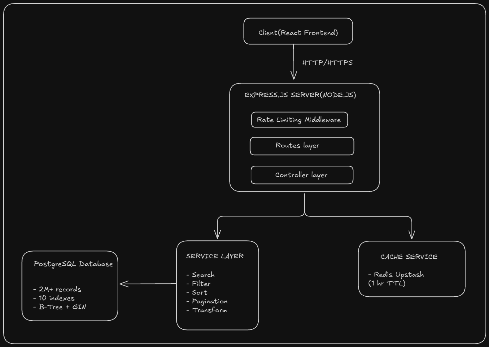
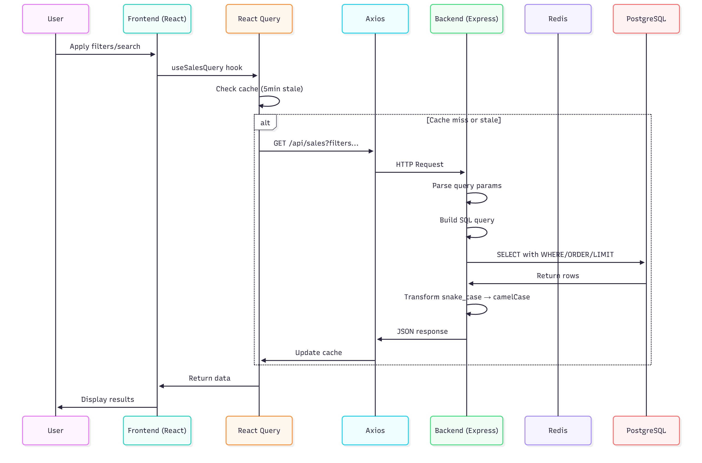
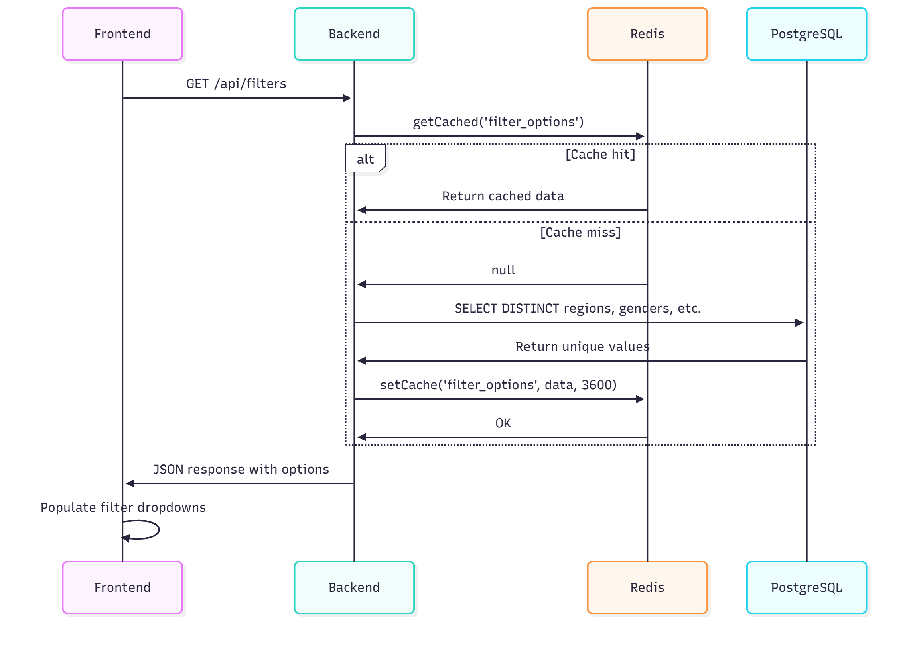

# Architecture Document

## System Overview

The Sales Management System is a full-stack web application designed to handle and visualize large-scale sales transaction data (2M+ records) with real-time search, filtering, sorting, and pagination capabilities. The architecture follows a three-tier design pattern with a React frontend, Express.js backend, and PostgreSQL database, optimized with Redis caching for performance.

---

## Backend Architecture

### Technology Stack
- **Runtime:** Node.js (ESM modules)
- **Framework:** Express.js
- **Database:** PostgreSQL 14+
- **Cache:** Redis (Upstash Redis REST API)

## Architecture Diagram




**Table Structure:**
- 26 columns including transaction_id (primary key)
- Customer fields: name, phone, region, gender, age
- Product fields: id, name, category, tags, brand
- Financial fields: quantity, price, discount, total_amount, final_amount
- Metadata: date, payment_method, order_status

---

## Frontend Architecture

### Technology Stack
- **Framework:** React 18.3
- **Build Tool:** Vite 5.4
- **Styling:** Tailwind CSS
- **State Management:** React Query (TanStack Query)
- **HTTP Client:** Axios
- **Custom Hooks:** useState, useEffect, useDebounce, useSalesData, useSalesQuery

---


**React Query Integration:**
- **`useSalesQuery.js`** wraps API calls
- **Caching:** 5-minute stale time, 10-minute cache time
- **Auto-refetch:** On window focus and network reconnect
- **Deduplication:** Multiple components can use same query

**Debouncing:**
- **`useDebounce.js`** hook delays search by 500ms
- Reduces API calls from every keystroke to one per pause


## Data Flow

### 1. Sales Data Request Flow



### 2. Filter Options Request Flow



---

## Folder Structure

```
TruEstate/
│
├── backend/
│   ├── database/
│   │   ├── migrate.js              # CSV → PostgreSQL migration script
│   │   ├── schema.sql              # Database schema with indexes
│   │   └── DATABASE_SETUP.md       # Setup instructions
│   │
│   ├── src/
│   │   ├── config/
│   │   │   └── db.js               # PostgreSQL connection pool
│   │   │
│   │   ├── controllers/
│   │   │   └── salesController.js  # getSales, getFilters
│   │   │
│   │   ├── services/
│   │   │   ├── cacheService.js          # Redis operations
│   │   │   ├── dataService.js           # Main orchestrator
│   │   │   ├── filterService.js         # WHERE clause builder
│   │   │   ├── filterOptionsService.js  # DISTINCT queries
│   │   │   ├── paginationService.js     # LIMIT/OFFSET logic
│   │   │   ├── searchService.js         # Full-text search
│   │   │   ├── sortService.js           # ORDER BY builder
│   │   │   └── transformService.js      # Data transformation
│   │   │
│   │   ├── middleware/
│   │   │   └── rateLimit.js        # Rate limiting (100 req/min)
│   │   │
│   │   ├── routes/
│   │   │   └── salesRoutes.js      # API route definitions
│   │   │
│   │   └── index.js                # Express server entry point
│   │
│   ├── .env.example                # Environment variables template
│   └── package.json                # Dependencies
│
├── frontend/
│   ├── src/
│   │   ├── components/
│   │   │   ├── FilterBar.jsx          # Multi-select filters
│   │   │   ├── MetricsCards.jsx       # Statistics display
│   │   │   ├── Pagination.jsx         # Page navigation
│   │   │   ├── SearchBar.jsx          # Search input
│   │   │   ├── Sidebar.jsx            # Navigation sidebar
│   │   │   ├── SortingDropdown.jsx    # Sort controls
│   │   │   └── TransactionTable.jsx   # Data grid
│   │   │
│   │   ├── hooks/
│   │   │   ├── useDebounce.js         # Debounce hook (500ms)
│   │   │   ├── useSalesData.js        # Main state management
│   │   │   └── useSalesQuery.js       # React Query hooks
│   │   │
│   │   ├── services/
│   │   │   └── api.js                 # Axios HTTP client
│   │   │
│   │   ├── App.jsx                    # Root component
│   │   ├── main.jsx                   # React entry point
│   │   └── index.css                  # Global styles
│   │
│   ├── public/                        # Static assets
│   ├── .env.example                   # Frontend env template
│   ├── tailwind.config.js             # Tailwind configuration
│   ├── vite.config.js                 # Vite configuration
│   └── package.json                   # Dependencies
│
├── docs/
│   ├── architecture.md                # This file
│   └── OPTIMIZATION.md                # Performance guide
│
├── .gitignore                         # Git ignore rules
└── README.md                          # Project documentation
```


---

## Performance Optimizations

### Database Level
1. **Indexes:** 10+ indexes cover all search, filter, and sort operations
2. **Connection Pooling:** Max 20 connections, reused across requests
3. **Parameterized Queries:** Prevents SQL injection, enables query plan caching
4. **Composite Indexes:** `idx_filter_combo` speeds up common filter combinations

### Backend Level
1. **Redis Caching:** Filter options cached for 1 hour (reduces DB load by 99%)
2. **Rate Limiting:** Prevents abuse (100 req/min general, 30 req/min search)
3. **Service Layer Separation:** Modular code for maintainability and testing
4. **Efficient Counting:** Separate optimized COUNT query for pagination

### Frontend Level
1. **React Query:** 5-minute cache prevents duplicate API calls
2. **Debouncing:** 500ms delay for search reduces API calls by 80-90%
3. **Code Splitting:** Vite lazy-loads components for faster initial load
4. **Memoization:** React Query automatically deduplicates requests


---

## Conclusion

This architecture provides a robust, scalable solution for managing and visualizing large sales datasets. The separation of concerns, extensive indexing, and strategic caching ensure high performance even with millions of records. The modular design allows for easy maintenance and future enhancements.
